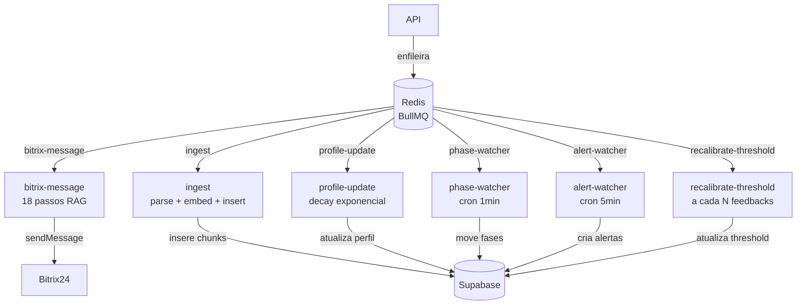

# Filas e Workers (BullMQ)

## Objetivo

Documentar os 6 jobs BullMQ que rodam em background no Worker.

## Onde fica

`apps/worker/src/jobs/` — um arquivo por job

## Diagrama

## Jobs em detalhe

### `bitrix-message` — Pipeline principal de resposta

**Quando**: toda mensagem recebida do Bitrix24  
**Retry**: 3x com backoff exponencial (1s, 2s, 4s)  
**Timeout**: 30s

Passos:
1. Carrega evento de `bitrix_events`
2. Upsert em `users` com dados do Bitrix
3. Upsert em `chat_sessions` (cria se nova)
4. INSERT mensagem do usuário em `chat_messages`
5. Carrega últimas 20 mensagens da sessão
6. Carrega `user_profiles.summary_text`
7. Gera embedding da pergunta
8. Busca chunks via `search_knowledge_chunks` RPC
9. Calcula confidence
10. Se cache hit → usa cache; senão chama LLM
11. Verifica confidence vs threshold
12. Monta prompt com persona Sofia + contexto + chunks
13. Chama LLM via ProviderRouter (com fallback)
14. Calcula custo (`ai_pricing`)
15. INSERT resposta Sofia em `chat_messages`
16. Grava no cache se novo
17. Enfileira `profile-update` se 10ª mensagem do usuário
18. Envia resposta no Bitrix24

---

### `ingest` — Ingestão de documentos

**Quando**: upload de documento pelo admin  
**Retry**: 5x (parsing pode falhar por timeout de URL)

Passos:
1. Atualiza `knowledge_documents.status = 'processing'`
2. Parser conforme `source_type`: PDF, DOCX, PPTX, URL, TXT
3. Chunker híbrido (semântico + sliding window)
4. Batch de embeddings (text-embedding-3-small)
5. INSERT em `knowledge_chunks` com `effective_date`/`expires_at`
6. Atualiza `status = 'processed'`

Em caso de falha: `status = 'failed'` + `error_msg`

---

### `profile-update` — Perfil analítico do usuário

**Quando**: toda 10ª mensagem do usuário  
**Retry**: 3x

Calcula com decay exponencial (peso = e^(-λ·Δt)):
- `top_topics`: ranking ponderado de categorias acessadas
- `knowledge_gaps`: perguntas com confidence baixa, ponderadas por recência
- `summary_text`: IA recebe resumo anterior + últimas N mensagens → novo resumo
- `sentiment`: classificação IA por sessão

---

### `phase-watcher` — Auto-transição do kanban

**Tipo**: cron a cada 1 minuto  
**Retry**: 1x (idempotente)

Para cada fase com `auto_transition_rules`:
- Regra `inactivity_minutes`: sessões inativas por N min → avança para próxima fase
- Usa `advance_session_phase()` PL/pgSQL

---

### `alert-watcher` — Alertas automáticos

**Tipo**: cron a cada 5 minutos  
**Retry**: 2x

Verifica e cria `admin_alerts` para:
- `cost_daily_exceeded`: custo do dia > `cost_budgets.limit_usd`
- `provider_circuit_open`: algum provider com `circuit_open_until > now()`
- `low_confidence_spike`: taxa "não sei" > X% nas últimas 100 msgs
- `documents_expiring`: documentos com `expires_at` em < 7 dias
- `suggestions_stale`: sugestões `pending` há > N dias

---

### `recalibrate-threshold` — Calibração adaptativa

**Quando**: a cada N novos feedbacks (default: 20)  
**Retry**: 2x

1. Carrega últimas 100 mensagens com feedback
2. Separa confidences com 👍 e 👎
3. Calcula threshold que maximiza F1
4. Atualiza `confidence_calibration.current_threshold`
5. Se `sample_count >= 50`: seta `confidence_calibrated = true`

## Arquivos relacionados

- `apps/worker/src/jobs/bitrix-message.ts`
- `apps/worker/src/jobs/ingest.ts`
- `apps/worker/src/jobs/profile-update.ts`
- `apps/worker/src/jobs/phase-watcher.ts`
- `apps/worker/src/jobs/alert-watcher.ts`
- `apps/worker/src/jobs/recalibrate-threshold.ts`
- `apps/worker/src/index.ts` — registra todos os workers

## Histórico de decisões

| Data | Decisão | Motivo |
|---|---|---|
| 2026-06-05 | BullMQ (não Bull v3 ou Agenda) | Suporte nativo a TypeScript; ativo em 2026 |
| 2026-06-05 | Decay exponencial no profile (λ≈0.05) | Meia-vida ~14 dias evita distorção por uso antigo |
| 2026-06-05 | phase-watcher como cron (não event-driven) | Simplifica; 1min de atraso é aceitável |
