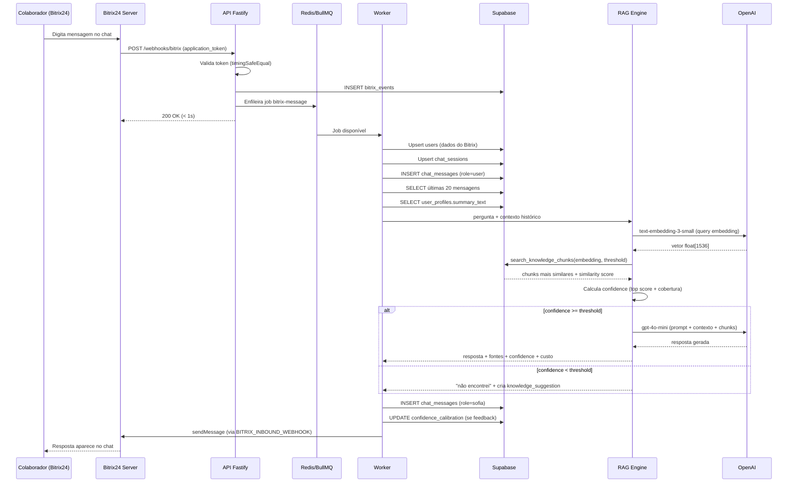

# Fluxo Bitrix24

## Objetivo

Descrever o ciclo completo de vida de uma mensagem: do colaborador digitando no Bitrix24 até a Sofia responder.

## Onde fica

- `apps/api/src/routes/webhooks/bitrix.ts` — recebe o evento
- `apps/worker/src/jobs/bitrix-message.ts` — processa o evento (18 passos)
- `packages/bitrix/src/sdk.ts` — envia resposta

## Como funciona

O Bitrix24 dispara um webhook POST para a API ao receber uma mensagem. A API valida o token, persiste o evento e enfileira um job no Redis. O Worker pega o job, executa o pipeline completo e chama a API do Bitrix para enviar a resposta.

## Diagrama

## Arquivos relacionados

- `apps/api/src/routes/webhooks/bitrix.ts`
- `apps/worker/src/jobs/bitrix-message.ts`
- `packages/bitrix/src/sdk.ts`
- `packages/rag/src/retriever.ts`
- `packages/rag/src/confidence.ts`

## Regras importantes

- A API deve responder em **< 3 segundos** para o Bitrix24 não retentar
- O Worker processa de forma assíncrona (pode demorar até 30s)
- Mensagens da própria Sofia (`FROM_USER_ID === BITRIX_SOFIA_USER_ID`) são **ignoradas** para evitar loops
- Se `chat_sessions.sofia_paused = true`, o Worker ignora a mensagem
- Cache de resposta: se mesma pergunta + mesmos chunks já foram respondidos (TTL 1h), usa cache e grava `cache_hit=true`

## Problemas conhecidos

| Erro | Causa | Solução |
|---|---|---|
| Loop de mensagens | Sofia respondeu sua própria mensagem | Verificar `BITRIX_SOFIA_USER_ID` no `.env` |
| 401 no webhook | Token outgoing incorreto ou expirado | Atualizar `BITRIX_OUTGOING_TOKEN` e reiniciar API |
| Timeout na resposta | RAG + LLM demorando > 3s | API já retorna 200 imediatamente; Worker processa async |

## Histórico de decisões

| Data | Decisão | Motivo |
|---|---|---|
| 2026-06-05 | Processamento assíncrono via BullMQ | API deve responder < 3s ao Bitrix; RAG pode demorar mais |
| 2026-06-05 | Ignorar próprias mensagens pelo user_id | Evitar loop; mais seguro que verificar author name |
