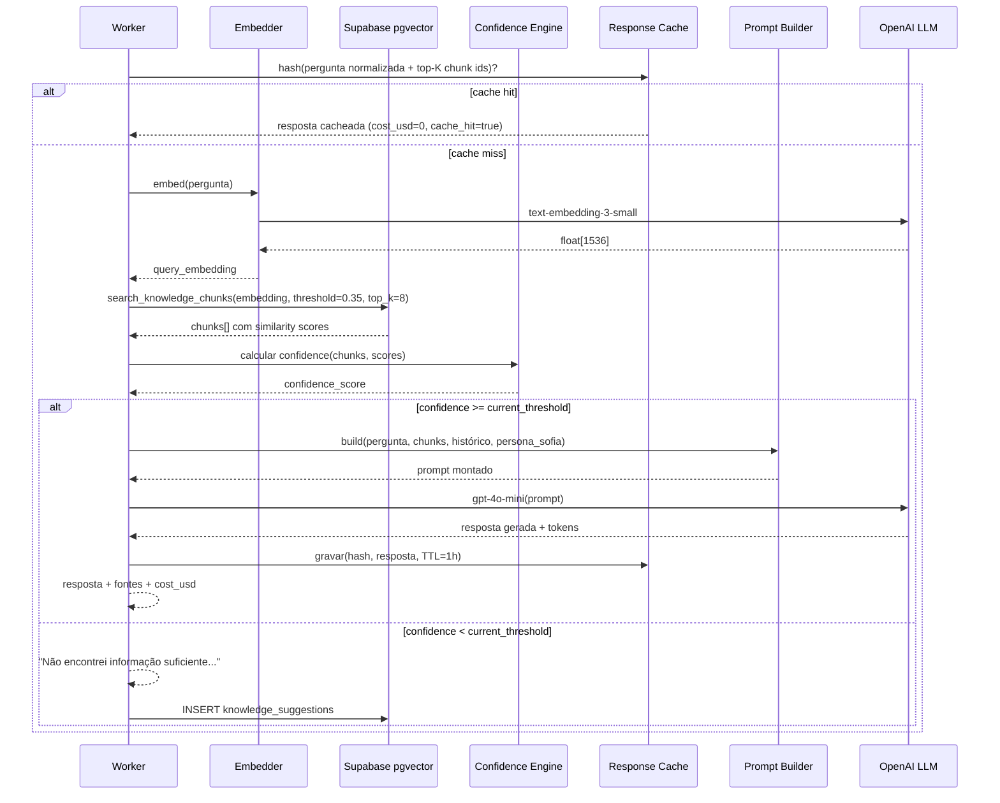

# Fluxo RAG (Retrieval-Augmented Generation)

## Objetivo

Explicar como a Sofia busca informações relevantes na base de conhecimento e monta uma resposta contextualizada.

## Onde fica

`packages/rag/src/` — módulo completo do RAG:

- `chunker.ts` — quebra documentos em pedaços
- `retriever.ts` — busca vetorial no pgvector
- `prompt.ts` — monta o prompt com persona + fontes
- `confidence.ts` — calcula e calibra o threshold
- `cache.ts` — cache de respostas (TTL 1h)

## Como funciona

1. Pergunta do usuário é convertida em vetor (embedding)
2. Vetor é comparado com todos os chunks armazenados (cosine similarity)
3. Top-K chunks mais similares são recuperados
4. Confidence é calculado: `max(similarities) * coverage_factor`
5. Se confidence ≥ threshold: monta prompt e chama LLM
6. Se confidence < threshold: responde "não encontrei" + cria sugestão

## Diagrama



## Chunking híbrido

O `chunker.ts` aplica estratégia em camadas:

```
1. Corte semântico por estrutura:
   - DOCX: quebra em H1/H2/H3
   - PPTX: quebra por slide
   - PDF: quebra por parágrafos maiores

2. Se seção > 500 tokens → sliding window (overlap 80 tokens)

3. Se seção < 150 tokens → agrupa com adjacente
```

## Threshold adaptativo

O threshold não é fixo. Ele é calibrado automaticamente:

```
Inicialmente: 0.5 (modo permissivo, confidence_calibrated=false)

A cada feedback 👍/👎:
  - Coleta as últimas N respostas com feedback
  - Calcula o percentil das confidences que receberam 👍
  - Ajusta threshold para maximizar F1

Singleton em confidence_calibration:
  - current_threshold: valor atual (0.0 a 1.0)
  - sample_count: total de feedbacks
  - confidence_calibrated: false = ainda em bootstrap
```

## Arquivos relacionados

- `packages/rag/src/chunker.ts`
- `packages/rag/src/retriever.ts`
- `packages/rag/src/prompt.ts`
- `packages/rag/src/confidence.ts`
- `packages/rag/src/cache.ts`
- `supabase/migrations/0002_search_rpc.sql` — função `search_knowledge_chunks`

## Regras importantes

- O retriever **nunca** faz SQL direto em `knowledge_chunks` — sempre via RPC `search_knowledge_chunks`
- Documentos expirados (`expires_at < now()`) são filtrados na função RPC
- O prompt sempre instrui a Sofia a **citar fontes** e **admitir incerteza**
- Cache usa hash da pergunta normalizada + IDs dos top chunks (não apenas a pergunta)

## Histórico de decisões

| Data | Decisão | Motivo |
|---|---|---|
| 2026-06-05 | Chunking híbrido (semântico + sliding window) | Chunks fixos perdem contexto em documentos estruturados |
| 2026-06-05 | Threshold adaptativo por feedback | Threshold fixo não se adapta ao conteúdo da base |
| 2026-06-05 | Cache por hash(pergunta + chunks) | Mesma pergunta com base diferente deve gerar resposta diferente |
| 2026-06-05 | RPC `search_knowledge_chunks` em vez de SQL direto | Encapsula lógica, permite otimização, atravessa RLS com SECURITY DEFINER |
