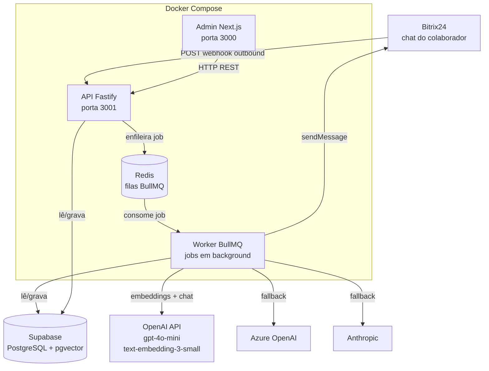

# Arquitetura Geral

## Objetivo

Descrever os componentes do sistema Sofia e como eles se comunicam.

## Onde fica

Arquivos de infraestrutura na raiz: `docker-compose.yml`, `Dockerfile.api`, `Dockerfile.worker`, `Dockerfile.admin`.

## Como funciona

O sistema é composto por três processos principais (API, Worker, Admin) e dois serviços de infraestrutura (Redis, Supabase). O Bitrix24 é externo e se comunica exclusivamente com a API.

## Diagrama

## Arquivos relacionados

- `docker-compose.yml` — orquestração de todos os containers
- `Dockerfile.api` — build da API Fastify
- `Dockerfile.worker` — build do Worker BullMQ
- `Dockerfile.admin` — build do Admin Next.js
- `apps/api/src/server.ts` — ponto de entrada da API
- `apps/worker/src/index.ts` — ponto de entrada do Worker

## Regras importantes

- Admin Next.js **nunca** acessa o Supabase diretamente — sempre via API Fastify
- A API usa `SUPABASE_SERVICE_ROLE_KEY` (bypassa RLS)
- O Bitrix24 só fala com `/webhooks/bitrix` (validado com `timingSafeEqual`)
- Todos os jobs críticos têm retry (3x com backoff exponencial)

## Checklist

- [x] API, Worker, Admin em containers separados
- [x] Redis para filas BullMQ
- [x] Supabase cloud (projeto `eeswigmlasmblrrvemzw`)
- [x] Healthchecks configurados no docker-compose
- [ ] Nginx/Traefik como reverse proxy (opcional)
- [ ] TLS automático via Let's Encrypt (opcional)

## Histórico de decisões

| Data | Decisão | Motivo |
|---|---|---|
| 2026-06-05 | Admin Next.js nunca acessa Supabase diretamente | Centraliza autenticação e auditoria na API |
| 2026-06-05 | Redis para BullMQ (não Postgres) | Performance de filas; Postgres já está saturado com dados |
| 2026-06-05 | Multi-provider IA desde o início | Evitar lock-in em OpenAI; resiliência de custo |
