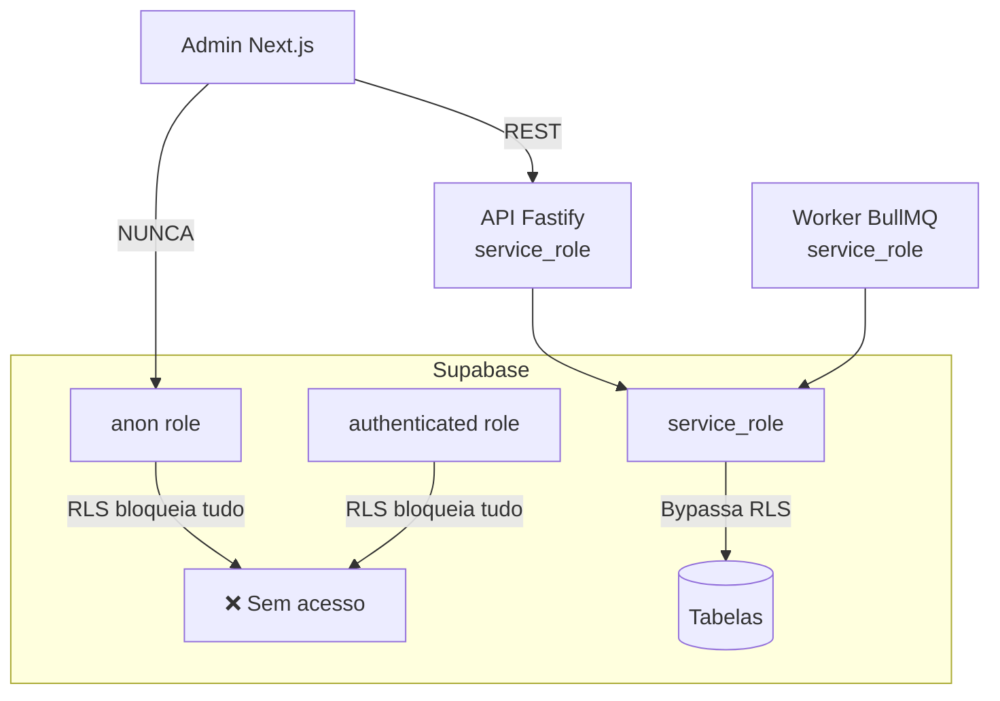

# Segurança

## Objetivo

Documentar o modelo de segurança implementado: RLS, cifra de credenciais, validação de webhooks e auditoria.

## Onde fica

- `supabase/migrations/0003_security_rls.sql` — RLS em todas as tabelas
- `supabase/migrations/0004_function_hardening.sql` — hardening de funções
- `packages/shared/src/crypto.ts` — AES-256-GCM
- `packages/shared/src/audit.ts` — audit log helper
- `apps/api/src/routes/webhooks/bitrix.ts` — validação Bitrix (timingSafeEqual)
- `apps/api/src/routes/admin/providers.ts` — cifra de credenciais
- `SECURITY.md` — política completa

## Diagrama



## Camadas de segurança

### 1. Row Level Security (RLS)

**Status**: habilitada em todas as 24 tabelas (migration `0003_security_rls.sql`)

**Estratégia default-deny**:
- `anon` role: zero acesso (sem policies)
- `authenticated` role: zero acesso (sem policies)
- `service_role`: bypassa RLS nativamente (usado por API + Worker)

**Por que é seguro**:
- Admin Next.js nunca acessa o Supabase diretamente
- Toda operação passa pela API Fastify que usa `service_role`
- Se o `SUPABASE_ANON_KEY` vazar, não há acesso a dados

### 2. Cifra de credenciais de providers

Credenciais em `ai_providers.config` são cifradas com **AES-256-GCM**:

```
Algoritmo: AES-256-GCM
Chave: CREDENTIAL_ENCRYPTION_KEY (32 bytes base64)
IV: 12 bytes aleatórios por cifra (nunca reutilizado)
Auth tag: 16 bytes (garante integridade + autenticidade)
```

A coluna `config` é **removida de todas as respostas da API** antes de enviar ao frontend.

### 3. Validação do webhook Bitrix

```typescript
// timingSafeEqual previne timing attacks
if (OUTGOING_TOKEN && !safeEqual(receivedToken, OUTGOING_TOKEN)) {
  logAuditBackground({ actor: 'system', action: 'webhook_auth_failure', ... })
  return reply.code(401).send({ error: 'Unauthorized' })
}
```

Comparação em tempo constante (independente do tamanho do match) evita que atacante infira o token correto medindo o tempo de resposta.

### 4. Funções PostgreSQL hardened

| Função | SECURITY | search_path |
|---|---|---|
| `search_knowledge_chunks` | DEFINER (atravessa RLS) | `public, pg_catalog` |
| `advance_session_phase` | INVOKER (caller = service_role) | `public, pg_catalog` |

`search_path` fixo evita "search_path hijacking" onde schema malicioso no início do path pode substituir funções do sistema.

### 5. Audit log

Toda mutação administrativa grava em `audit_logs`:

```typescript
await logAudit({
  actor: req.user?.id ?? 'admin',
  action: 'approve',
  entity: 'knowledge_suggestions',
  entityId: id,
  before: { status: 'pending' },
  after: { status: 'approved' },
})
```

## Checklist de segurança

- [x] RLS habilitada em todas as 24 tabelas
- [x] Nenhuma policy anon/authenticated (default-deny)
- [x] `service_role` usado apenas em API e Worker
- [x] Admin Next.js nunca acessa Supabase direto
- [x] `ai_providers.config` cifrado com AES-256-GCM
- [x] Config nunca exposta em respostas da API
- [x] Token Bitrix validado com `timingSafeEqual`
- [x] Falhas de autenticação gravadas em `audit_logs`
- [x] `search_path` fixo em funções PostgreSQL
- [x] `advance_session_phase` com SECURITY INVOKER
- [x] `search_knowledge_chunks` com SECURITY DEFINER justificado

## Histórico de decisões

| Data | Decisão | Motivo |
|---|---|---|
| 2026-06-05 | Default-deny sem policies (não policies permissivas) | Mais seguro; qualquer acesso não autorizado falha em vez de acertar por default |
| 2026-06-05 | AES-256-GCM (não AES-CBC) | GCM garante autenticidade além de confidencialidade |
| 2026-06-05 | timingSafeEqual (não ===) | Previne timing attacks em validação de tokens |
| 2026-06-05 | CREDENTIAL_ENCRYPTION_KEY separada do JWT_SECRET | Rotação independente; comprometimento de um não compromete o outro |
