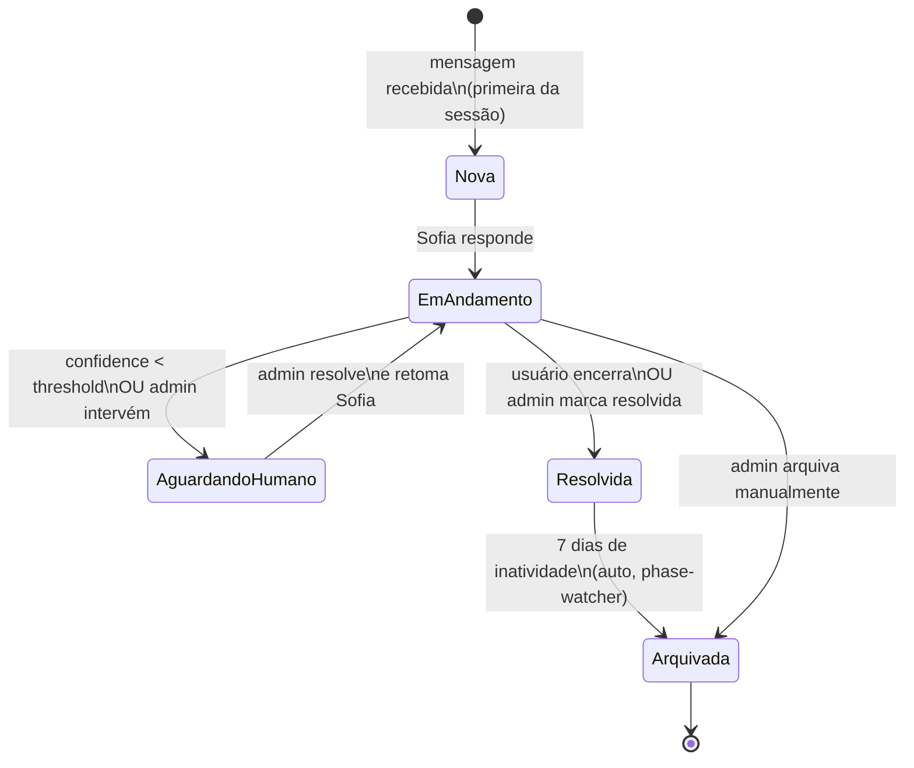

# Fluxo do Kanban

## Objetivo

Documentar as transições de fase das conversas no kanban.

## Onde fica

- `supabase/migrations/0001_init.sql` — tabela `conversation_phases` + `conversation_phase_transitions`
- `apps/worker/src/jobs/phase-watcher.ts` — auto-transição via cron
- `supabase/migrations/0001_init.sql` — função `advance_session_phase()`

---

## Fases padrão

| Ordem | Código | Nome exibido | Auto-transição |
|---|---|---|---|
| 1 | `new` | Nova | — |
| 2 | `in_progress` | Em andamento | Inatividade 30min → Nova |
| 3 | `waiting_human` | Aguardando humano | — |
| 4 | `resolved` | Resolvida | 7 dias → Arquivada |
| 5 | `archived` | Arquivada | — |

---

## Diagrama de estados

---

## Regras de negócio

### Quando Sofia é pausada

1. Admin clica "Pausar Sofia" no drawer
2. `chat_sessions.sofia_paused = true`
3. Fase move para `waiting_human`
4. Sofia para de responder QUALQUER mensagem desta sessão
5. Admin pode enviar mensagem manual que aparece como Sofia

### Quando Sofia é retomada

1. Admin clica "Retomar Sofia"
2. `chat_sessions.sofia_paused = false`
3. Fase move para `in_progress`
4. Sofia responde normalmente na próxima mensagem

### Auto-transição (phase-watcher cron)

Cron a cada 1 minuto verifica `auto_transition_rules` de cada fase:
- `inactivity_minutes: 30` → se nenhuma mensagem em 30min, avança para próxima fase
- `max_duration_hours: 168` → 7 dias → arquiva

### Drag-and-drop no kanban

- Arrastar card de uma coluna para outra grava em `conversation_phase_transitions`
- Campos: `session_id, from_phase, to_phase, actor_id, reason`
- `reason` é opcional (admin pode deixar note)

---

## Tabelas envolvidas

| Tabela | Relevância |
|---|---|
| `conversation_phases` | Seed com 5 fases + regras de auto-transição |
| `chat_sessions` | `current_phase_id` + `sofia_paused` |
| `conversation_phase_transitions` | Histórico completo de movimentos |

## Histórico de decisões

| Data | Decisão | Motivo |
|---|---|---|
| 2026-06-05 | Fases configuráveis em DB (não enum hardcoded) | Fortatech pode precisar de fases adicionais no futuro |
| 2026-06-05 | Fase `waiting_human` separada de `in_progress` | Necessário para SLA de atendimento humano |
