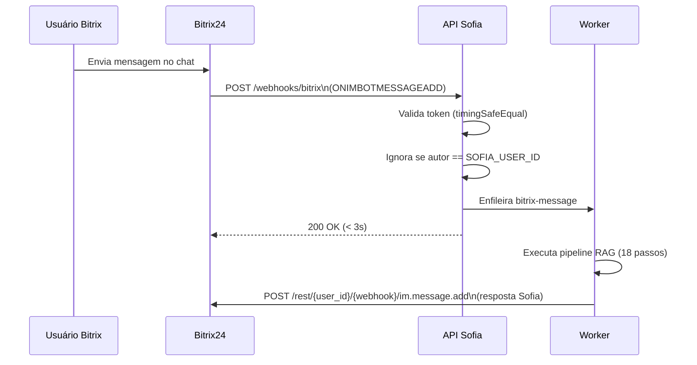

# Integração com Bitrix24

## Objetivo

Descrever como a Sofia se conecta ao Bitrix24, incluindo webhook inbound e outbound.

## Onde fica

- `packages/bitrix/src/sdk.ts` — SDK de envio
- `apps/api/src/routes/webhooks/bitrix.ts` — recebimento
- `apps/worker/src/jobs/bitrix-message.ts` — processamento

---

## Arquitetura



---

## Webhooks

### Webhook Inbound (Bitrix chama a Sofia)

**Como configurar**:
1. Bitrix24 → Aplicativos → Webhooks → Criar webhook inbound
2. URL: `https://sua-api.dominio.com/webhooks/bitrix`
3. Evento: `ONIMBOTMESSAGEADD`
4. O Bitrix gera `application_token` que vai em todo POST

**Validação**:
```typescript
const receivedToken = body.auth?.application_token
if (OUTGOING_TOKEN && !safeEqual(receivedToken, OUTGOING_TOKEN)) {
  return reply.code(401)
}
```

> ⚠️ `BITRIX_OUTGOING_TOKEN` é o `application_token` gerado pelo Bitrix.
> Confusamente, no código da Sofia chamamos de "outgoing token" porque é o token que o Bitrix manda *para* a Sofia.

### Webhook Outbound da Sofia (Sofia chama o Bitrix)

**Como configurar**:
1. Bitrix24 → Aplicativos → Webhooks → Criar webhook outbound
2. Permissões: `im` (mensagens instantâneas)
3. Usuário: conta da Sofia
4. Salvar URL gerada em `BITRIX_INBOUND_WEBHOOK`

**Como usar**:
```typescript
import { sendMessage } from '@sofia/bitrix'

await sendMessage(dialogId, 'Olá! Posso ajudar com sua dúvida.')
```

---

## Identificação da Sofia

A Sofia usa `BITRIX_SOFIA_USER_ID` para não processar suas próprias mensagens:

```typescript
const authorId = event.data?.PARAMS?.FROM_USER_ID
if (authorId?.toString() === BITRIX_SOFIA_USER_ID) {
  return // ignora — evita loop infinito
}
```

---

## Eventos suportados

| Evento | Descrição |
|---|---|
| `ONIMBOTMESSAGEADD` | Nova mensagem em chat onde Sofia está |

## Eventos ignorados (por enquanto)

| Evento | Motivo |
|---|---|
| `ONIMJOINCHAT` | Sofia entrou no chat |
| `ONIMBOTJOINCHAT` | Sofia adicionada via bot |
| Reações 👍/👎 | Planejado para v1.1 |

---

## Permissões necessárias no Bitrix24

- Usuário Sofia deve ser adicionado aos grupos/chats onde deve responder
- Webhook outbound precisa de scope `im`
- Usuário Sofia precisa de permissão para enviar mensagens nos chats

## Troubleshooting

Ver `docs/09-bugs-e-solucoes/erros-conhecidos.md` para lista de erros comuns.
