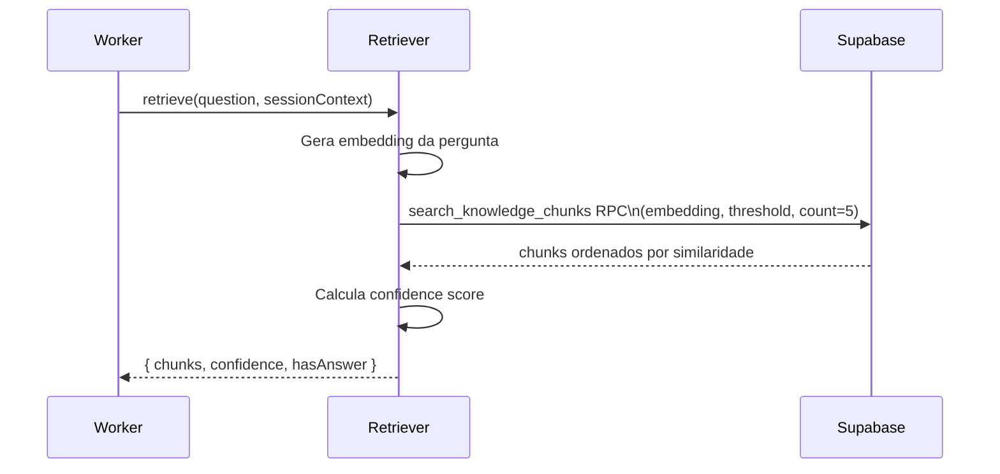
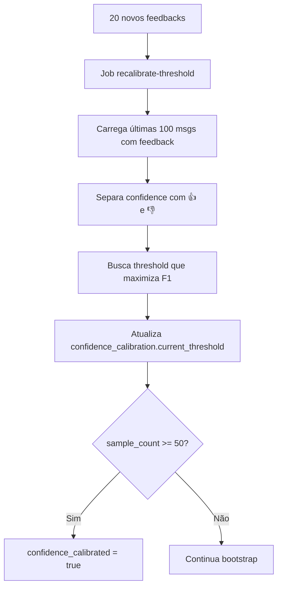

# Retrieval e Confidence

## Objetivo

Documentar o processo de busca RAG e o sistema de confidence adaptativo.

## Onde fica

- `packages/rag/src/retriever.ts` — busca + reranking
- `packages/rag/src/confidence.ts` — score e calibração
- `apps/worker/src/jobs/recalibrate-threshold.ts` — recalibração automática
- `supabase/migrations/0002_search_rpc.sql` — RPC de busca

---

## Fluxo de retrieval



---

## Confidence score

O confidence score combina:
1. **Similaridade máxima** do melhor chunk
2. **Dispersão dos top-5** (chunks muito dispersos = sinal fraco)
3. **Cobertura da pergunta** (estimativa de quão bem os chunks cobrem a pergunta)

Fórmula simplificada:
```
confidence = 0.6 * maxSimilarity 
           + 0.3 * (1 - dispersão) 
           + 0.1 * cobertura
```

Se `confidence < threshold` → Sofia responde "Não encontrei informações sobre isso na nossa base".

---

## Calibração adaptativa

### Objetivo

Encontrar o threshold que maximiza F1:
- **Precision**: quando Sofia responde, está certa
- **Recall**: quando há resposta disponível, Sofia a dá

### Fluxo



### Tabela `confidence_calibration`

| Campo | Tipo | Descrição |
|---|---|---|
| `current_threshold` | float | Threshold atual |
| `sample_count` | int | Feedbacks acumulados |
| `precision_at_threshold` | float | Precision no threshold atual |
| `recall_at_threshold` | float | Recall no threshold atual |
| `last_calibrated_at` | timestamp | Última calibração |
| `confidence_calibrated` | bool | ≥ 50 amostras usadas |

---

## Critérios de produção

Antes de liberar para usuários reais:
- [ ] Golden set de 50-100 Q&A reais criado
- [ ] `precision_at_threshold >= 0.85`
- [ ] `recall_at_threshold >= 0.75`
- [ ] `confidence_calibrated = true`

---

## Cache de respostas

`packages/rag/src/cache.ts` implementa cache para evitar chamadas LLM repetidas:
- Chave: SHA-256 da pergunta normalizada
- TTL: 1 hora (configurável)
- Armazenado em `response_cache`

## Histórico de decisões

| Data | Decisão | Motivo |
|---|---|---|
| 2026-06-05 | Threshold bootstrap 0.5 (não 0.35) | 0.35 gera muitas respostas incorretas antes de calibração |
| 2026-06-05 | Recalibrar a cada 20 feedbacks | Balanço entre convergência rápida e estabilidade |
| 2026-06-05 | match_count=5 (não 10) | 5 chunks já fornecem contexto suficiente; 10 aumenta custo do prompt |
